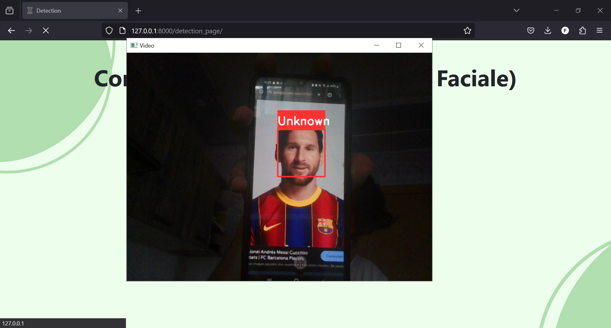

#Facial Recognition Attendance Notification Platform

## Table of Contents
* [General Info](#general-information)
* [Technologies Used](#technologies-used)
* [How does it work ?](#How-does-it-work-?)
<!-- * [License](#license) -->

## General Information
The facial recognition system captures real-time video feed from a webcam, detecting and recognizing faces using the LBPH (Local Binary Patterns Histograms) algorithm. The system systematically processes each frame to extract facial features, which are then compared against a pre-trained model to identify individuals. Upon successful recognition, the system logs the presence of the identified individuals into a MySQL database. Django orchestrates the entire process, managing user authentication, data storage, and real-time updates. As a final step, the recognized faces and their corresponding presence data are displayed on an interactive web dashboard, providing a comprehensive overview of attendance.
<!-- You don't have to answer all the questions - just the ones relevant to your project. -->

## Technologies Used
- Python
- Django
- OpenCV
- MySQL
- Pandas

## How does it work ?
On the homepage, if you want to sign up, you enter your name and a password.

Once the account is created, you are redirected to the next page, which allows you to scan your face so that the system can recognize you later.

 If you want to log in by entering your credentials, you will be redirected to the next page where the system will try to detect the face of the person who logged in.

 If it detects the user's face for 5 continuous seconds, their presence will be noted.

However, if it does not detect the face, the person will be marked as "Not detected."

<!-- If you have screenshots you'd like to share, include them here. -->

<!-- Optional -->
<!-- ## License -->
<!-- This project is open source and available under the [... License](). -->

<!-- You don't have to include all sections - just the one's relevant to your project -->
